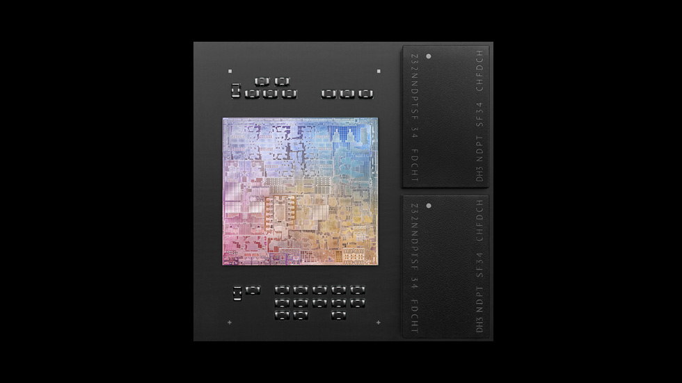

# Apple Silicon

Waldo Wautelet

---

# Inhoudsopgave

* Waarom verandering?
* Waarom ARM?
* Wanneer?
* Geschiedenis
* Wat is de M1?
* Vergelijkingen met concurrenten

---

# Waarom veranderen?

Geld.

---

# Waarom ARM?

voordelen:
* goedkoper dan volledige CPU
* lager energieverbruik

nadelen:
* incompatibel met x86
* limiet op instructies

---

# Wanneer?

Eerste keer in 2010 (iPhone, iPad, ...).

Tweede keer in 2020 (macbook air).

--- 

# Geschiedenis

1990: Motorola 68000 -> PowerPC

2005: PowerPC -> intel

2020: intel -> Apple Silicon (ARM)

---

# Wat is de M1?

* chip voor Mac
* System On a Chip
* 5-nm process
* 16 miljard transistoren
* 4 P-cores + 4 E-cores

### Efficientie!

---

# Vergelijkingen met concurrenten

Meest logische vergelijking met intel en AMD:

Devices voor vergelijking:
1. Apple macbook air M2
2. Dell XPS 13 i7
3. Asus zenbook 13 Ryzen 7 6000 

| Vergelijking | Apple | Intel | AMD | 
| ------------ | ----- | ----- | --- |
| specs        | M2    | i7-1280P | R7 6800U | 
| cores        | 8-core (4+4) | 14-core (6+8) | 8-core  |
| threads      | 8     | 20    | 16  |

---

# Resultaten

| Vergelijking | Apple | Intel | AMD | 
| ------------ | ----- | ----- | --- |
| power        | 21W   | 44W   | 28W |
| efficientie  | 409 ppw | 244 ppw | 374 ppw |
| performance cR23 | 1585p | 1793p | 1488p |
| multicore    | 8154p | 10383p | 9413p |